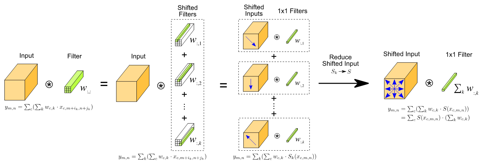

# Active Shift Layer

This repository contains the implementation for Active Shift Layer (ASL).

Please see the paper [Constructing Fast Network through Deconstruction of Convolution](https://papers.nips.cc/paper/7835-constructing-fast-network-through-deconstruction-of-convolution.pdf). 

This paper is accepted in NIPS 2018 as spotlight session ([slide](supplement/presentation_rev2.pdf), [poster](supplement/poster_rev1.pdf))

The code is based on [Caffe](https://github.com/BVLC/caffe)  
Tensorflow implementation is also available at [ASL-TF](https://github.com/jyh2986/Active-Shift-TF)

## Introduction

### Deconstruction 
Naive spatial convolution can be deconstructed into a shift layer and a 1x1 convolution.

This figure shows the basic concept of deconstruction.

### Active Shift Layer (ASL)
For the efficient shift, we proposed active shift layer.
  * Uses depthwise shift
  * Introduced new shift parameters for each channel    
  * New shift parameters(alpha, beta) are learnable

## Usage
ASL has 2 parameters : the shift amount (alpha,beta)  
Using asl_param, you can control hyper-parameters for ASL. Please see the <i>caffe.proto</i>

This is the example of a usage. Please refer [CIFAR10 prototxt](models/ASL_Model/CIFAR10) for more details.

    layer {
      name: "shift0"
      type: "ActiveShift"
      bottom: "conv0"
      top: "shift0"
      param {
        lr_mult: 0.001
        decay_mult: 0.0
      }
      param {
        lr_mult: 0.001
        decay_mult: 0.0
      }
      asl_param {
        normalize: true
      }
    }
    

## How to test code
You can validate backpropagation using test code.
Because it is not differentiable on lattice points, you should not use integer point position when you are testing code.
It is simply possible to define "TEST_ASHIFT_ENV" macro in <i>active_shift_layer.hpp</i>

1. Define "TEST_ASHIFT_ENV" macro in active_shift_layer.hpp
2. \> make test
3. \> ./build/test/test_active_shift_layer.testbin

You should pass all tests.
Before the start, <b>don't forget to undefine TEST_ASHIFT_ENV macro and make again.</b>

## Trained Model
You can download trained ImageNet model [here](models/ASL_Model/ImageNet/test_model).

## TODO
- [x] Update Readme
- [x] Upload trained ImageNet model 
- [x] Upload CIFAR10 prototxt

